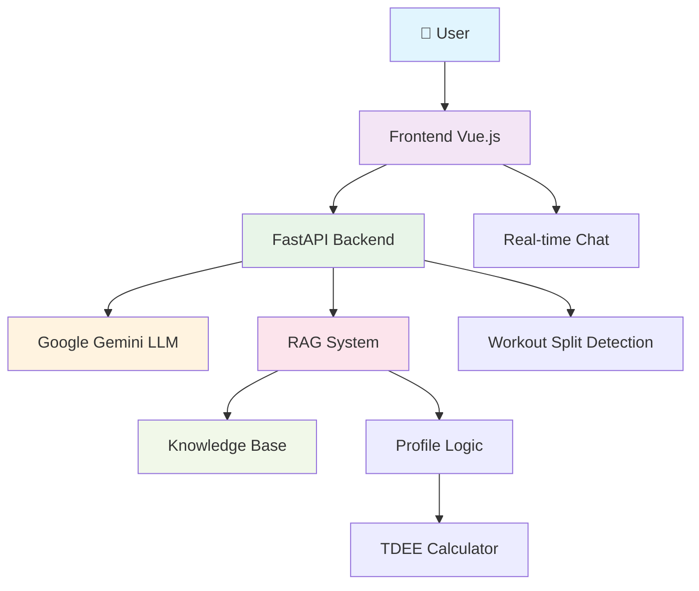
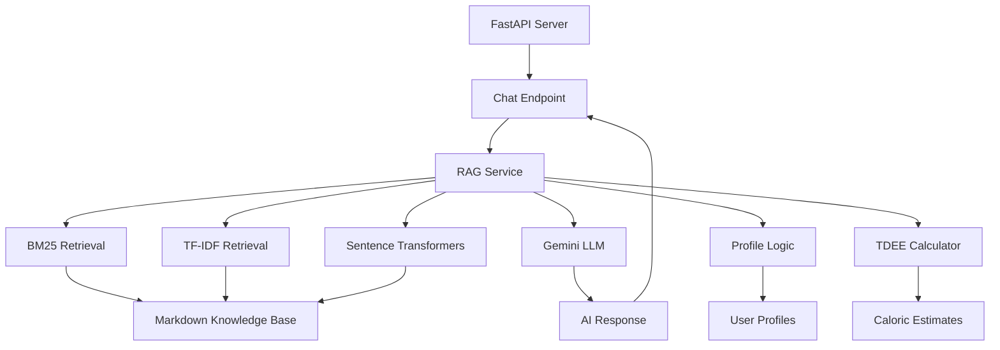
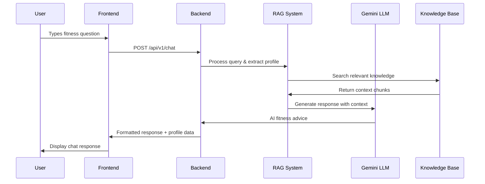

# Hypertrofit

[](https://github.com/JoeyRudd/ai-fitness-coach/actions)
[](https://python.org)
[](https://vuejs.org)
[](https://fastapi.tiangolo.com)
[](https://tailwindcss.com)
[](https://docker.com)
[](https://railway.app)
[](https://web.dev/progressive-web-apps/)

<!-- Test commit for Railway deployment -->

A simple, user-friendly AI-powered fitness and nutrition coach application designed for beginners. The AI provides encouraging, safety-first advice using plain English explanations.

## Features

- AI-powered fitness and nutrition advice
- Beginner-friendly interface designed for easy use
- Interactive chat interface with real-time responses
- Safety-first approach with doctor consultation recommendations
- Responsive design with TailwindCSS
- **NEW: Enhanced workout split guidance** - Specific schedules and exercise recommendations
- **NEW: BM25 retrieval support** - Better handling of short queries and workout-related questions
- **🎯 PWA Features**: Install as mobile app, offline access, and native app-like experience

## Progressive Web App (PWA)

Hypertrofit now supports Progressive Web App functionality, allowing users to install and use the app like a native mobile application.

### PWA Capabilities

- **📱 Install to Home Screen**: Add the app to your phone's home screen like a native app
- **🔄 Offline Access**: Core functionality works without internet connection
- **⚡ Fast Loading**: Service worker caches assets for instant loading
- **📲 App-Like Experience**: Full-screen mode with no browser UI
- **🔄 Auto-Updates**: App updates automatically in the background

### PWA Installation

**On Android/Chrome:**
1. Open the app in Chrome browser
2. Tap the menu (⋮) → "Add to Home Screen"
3. Tap "Add" to install

**On iOS/Safari:**
1. Open the app in Safari browser
2. Tap the Share button → "Add to Home Screen"
3. Tap "Add" to install

**After Installation:**
- App icon appears on your home screen
- Opens in standalone mode (no browser UI)
- Works offline with cached content
- Receives automatic updates

### PWA Technical Implementation

- **Manifest.json**: Defines app metadata, icons, and display preferences
- **Service Worker**: Handles caching, offline functionality, and background updates
- **PWA Meta Tags**: Enables mobile app-like behavior and theming
- **Responsive Design**: Optimized for mobile devices and various screen sizes

## Tech Stack

### Backend
| Component | Technology | Purpose |
|-----------|------------|---------|
| Framework | FastAPI | High-performance async API framework |
| AI Model | Google Gemini | LLM for generating responses |
| RAG System | BM25 + TF-IDF | Intelligent knowledge retrieval |
| Data Models | Pydantic | Type-safe request/response validation |
| Deployment | Railway + Docker | Cloud hosting with containerization |

### Frontend
| Component | Technology | Purpose |
|-----------|------------|---------|
| Framework | Vue 3 + Composition API | Modern reactive UI framework |
| Build Tool | Vite | Fast development and optimized builds |
| Styling | TailwindCSS | Utility-first CSS framework |
| HTTP Client | Axios | Promise-based API communication |
| Language | TypeScript | Type-safe JavaScript development |
| PWA Support | Service Worker + Manifest | App installation and offline functionality |
| Deployment | Netlify | Global CDN with automatic HTTPS |

### Testing & Quality
| Component | Status | Details |
|-----------|--------|---------|
| Test Suite | 57/57 tests passing | Comprehensive backend testing with full coverage |
| CI/CD | Automated | GitHub Actions workflow |
| Deployment | Production ready | Railway + Netlify deployment |

## 🚀 Quick Start

### Prerequisites
- Python 3.11+
- Node.js 18+
- Google Gemini API key

### Installation & Setup
```bash
# Clone and setup backend
git clone https://github.com/JoeyRudd/ai-fitness-coach.git
cd ai-fitness-coach
make install
export GEMINI_API_KEY=your_api_key_here
make backend

# Setup frontend (new terminal)
cd frontend
npm install
npm run dev
```

### Environment Variables
```bash
# Backend
GEMINI_API_KEY=your_google_ai_api_key
ALLOWED_ORIGINS=http://localhost:5173

# Frontend
# No environment variables needed - automatically detects dev/prod mode
```

### PWA Development Testing
For testing PWA features during development:
```bash
# Enable network access for mobile testing
cd frontend
npm run dev -- --host

# Then access from mobile device at:
# http://[YOUR_COMPUTER_IP]:5173
```

### Testing
```bash
make test
```

## 📚 API Reference

**Base URL**: `http://localhost:8000/api/v1`

### Endpoints

| Method | Endpoint | Description |
|--------|----------|-------------|
| POST | `/chat` | Chat with AI fitness coach |
| GET | `/healthz` | Health check |
| GET | `/` | App status |

### POST `/chat`
**Request:**
```json
{
  "message": "Create a workout plan",
  "history": []
}
```

**Response:**
```json
{
  "response": "Here's your workout plan...",
  "profile": { "age": 25, "weight_kg": 70 },
  "tdee": { "bmr": 1700, "tdee": 2200 },
  "missing": ["activity_factor"],
  "intent": "workout"
}
```

### GET `/healthz`
**Response:**
```json
{ "status": "ok" }
```

### GET `/`
**Response:**
```json
{
  "message": "AI Fitness Coach running",
  "model": "gemini-1.5-flash",
  "rag_status": "ready"
}
```

## 🏗️ Architecture

### System Overview


### Backend Architecture


### Chat Flow


## Project Structure

```
hypertrofit/
├── backend/
│   ├── app/
│   │   ├── main.py              # FastAPI application (single app instance)
│   │   ├── api/
│   │   │   └── v1/endpoints/    # Versioned API routers
│   │   ├── core/                # Config / settings
│   │   ├── models/              # Pydantic models (may be split later into schemas/)
│   │   └── services/            # Business / RAG logic
│   └── pyproject.toml           # Python dependencies and config
├── frontend/
│   ├── src/
│   │   ├── App.vue              # Main application component
│   │   ├── components/          # Vue components
│   │   └── main.js              # Frontend entry point
│   ├── package.json             # Node.js dependencies
│   └── vite.config.ts           # Vite configuration
├── knowledge_base/              # Fitness knowledge content (for RAG)
│   ├── 01_training_frequency.md # Workout splits, training frequency, schedules
│   ├── 02_training_intensity.md
│   ├── 03_optimal_nutrition.md
│   ├── 04_strength_training_basics.md # Beginner exercises, workout organization
│   ├── 05_cardio_fundamentals.md
│   ├── 06_recovery_rest.md
│   ├── 07_goal_setting_motivation.md
│   └── 08_faq.md
└── rules.md                     # Development guidelines
```

## Target User

Designed specifically for beginners (like a 45-year-old starting their fitness journey) who need:
- Simple, encouraging language
- Safety-first recommendations
- Clear, actionable steps
- No overwhelming technical jargon
- **Specific workout guidance** - Full body splits, schedules, exercise recommendations

## Environment Variables

| Name | Scope | Default | Description |
|------|-------|---------|-------------|
| GEMINI_API_KEY | backend | (empty) | Google Generative AI API key. If missing, system returns deterministic fallback instead of failing. |
| GEMINI_MODEL / GEMINI_MODEL_NAME | backend | gemini-1.5-flash | Model name. `gemini_client` reads `GEMINI_MODEL`; settings class uses `GEMINI_MODEL_NAME`. Either works. |
| ALLOWED_ORIGINS | backend | http://localhost:5173 | Comma-separated list for CORS (frontend dev origin). |
| KNOWLEDGE_BASE_PATH | backend | knowledge_base | Override location of markdown knowledge base. |
| EMBEDDING_MODEL_NAME | backend | all-MiniLM-L6-v2 | Sentence transformer model used for embeddings. |
| MAX_RETRIEVAL_CHUNKS | backend | 3 | How many context chunks to inject into prompt. |

## Architecture Overview

- **API Layer:** FastAPI app (`backend/app/main.py`) mounting versioned routers (`api/v1/endpoints/chat.py`).
- **Models:** Pydantic data models in `models/chat.py` standardize message, profile, and response payloads.
- **Services Layer:**
  - `rag_service.RAGService`: Intent detection (TDEE vs general), profile extraction, recall, TDEE calculation, RAG grounding, LLM call / fallback, **workout split detection and fallback responses**.
  - `rag_index.RAGIndex`: Loads markdown, chunks, and uses **BM25 as primary retrieval method** for better short query handling. Falls back to TF-IDF (scikit-learn) or sentence-transformers (MiniLM) with NumPy/FAISS for similarity.
  - `profile_logic.py`: Fact extraction & calculations.
  - `gemini_client.py`: Gemini SDK wrapper with simple generation call.
- **Knowledge Base:** Local markdown sources in `knowledge_base/` ground general fitness answers with **comprehensive workout split information**.
- **Fallback Logic:** If LLM not configured, deterministic supportive responses with **specific workout split guidance**.

## RAG Retrieval Flow
1. Load markdown docs from `knowledge_base/` (recursive).
2. Chunk into ~800 char windows with overlap.
3. **Primary: BM25 indexing** for optimal short query and workout question handling.
4. **Fallback 1:** TF-IDF (scikit-learn) for chunk embedding and retrieval.
5. **Fallback 2:** Sentence transformers (MiniLM) with normalization.
6. Store chunk vectors in memory (no external DB).
7. On user query (non-TDEE):
   - **BM25 retrieval** for workout split questions and short queries
   - **Hybrid retrieval** combining multiple methods for optimal results
   - **Workout split detection** with specialized fallback responses
8. Inject context block into prompt with anti-hallucination guidance.
9. **Enhanced fallback:** Deterministic supportive responses with specific workout split schedules and exercise recommendations.

## New Features

### Enhanced Workout Split Guidance
- **Full Body Split**: Monday/Wednesday/Friday schedule with rest days
- **Upper/Lower Split**: 4-day training schedule for intermediate beginners
- **Push/Pull/Legs**: 6-day advanced split for experienced lifters
- **Specific Exercise Recommendations**: leg press, chest press, lat pulldown, shoulder press
- **Progression Paths**: Clear guidance on when to advance to more complex splits

### BM25 Retrieval System
- **Better Short Query Handling**: Improved retrieval for workout-related questions
- **Hybrid Search**: Combines BM25 with traditional methods for optimal results
- **Workout Split Detection**: Automatically identifies and responds to workout split questions
- **Intelligent Fallbacks**: Provides helpful guidance even when RAG retrieval doesn't find optimal content

## Local Development

Backend:
```
make install
make backend
```
Frontend:
```
cd frontend
npm install
npm run dev
```

## Testing

```bash
make test
```

The test suite includes comprehensive coverage of:
- **API Endpoints** (11 tests) - Chat functionality, health checks, error handling
- **Chat Flow** (4 tests) - End-to-end chat interactions and responses
- **Error Handling** (21 tests) - Invalid requests, API errors, edge cases
- **RAG System** (3 tests) - Hybrid retrieval, short queries, indexing
- **Profile Logic** (4 tests) - User profile extraction and TDEE calculations
- **Intent Detection** (6 tests) - Workout vs nutrition intent classification
- **TDEE Calculations** (5 tests) - Caloric estimation accuracy
- **Short Queries** (3 tests) - BM25 retrieval for brief questions

All tests pass with comprehensive backend coverage.

## Recent Updates

- **PWA Implementation**: Added Progressive Web App functionality for mobile app-like experience
- **Service Worker & Caching**: Implemented offline support and fast loading capabilities
- **Add to Home Screen**: Users can now install the app like a native mobile application
- **Workout Split Enhancements**: Added comprehensive workout split guidance with specific schedules and exercise recommendations
- **BM25 Integration**: Implemented BM25 retrieval for better short query handling
- **Improved RAG Service**: Enhanced prompt construction and fallback responses for workout questions
- **Knowledge Base Expansion**: Added detailed workout split information and training frequency guidance


